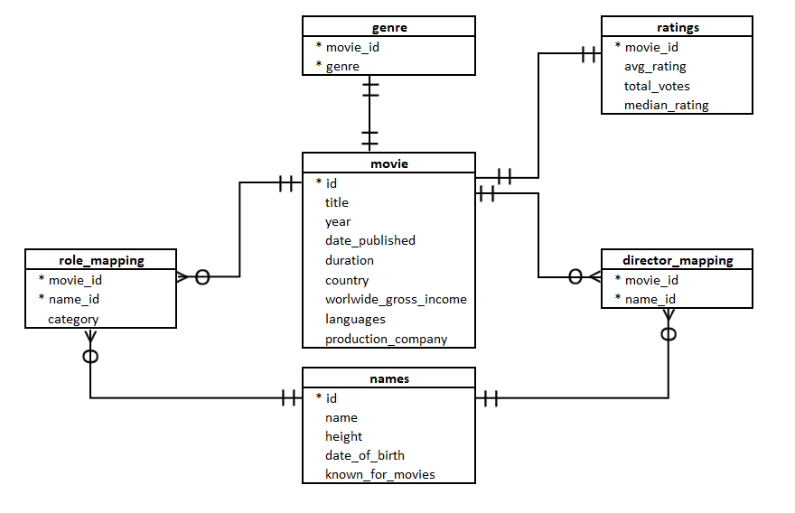
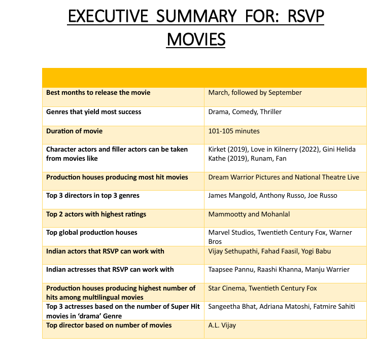

# Movie Ratings Analysis for RSVP Movies

## Project Overview

RSVP Movies, a leading Indian film production company known for producing successful movies, planned to expand its reach to a global audience. To support strategic decision-making, historical movie data from the previous three years was analyzed using SQL.

The objective was to identify patterns and trends related to movie genres, directors, actors, production houses, release timing, and audience preferences in order to recommend an optimal strategy for RSVP Movies' next global release.

---

## Business Problem

RSVP Movies wanted to make data-driven decisions for its upcoming international project. The analysis aimed to answer key business questions such as:

- Which movie genres perform the best?
- What is the ideal release period for maximum success?
- Which directors consistently deliver highly rated movies?
- Which actors and actresses attract the highest ratings?
- Which production houses produce the most successful films?
- What characteristics are common among blockbuster movies?

The analysis was performed using SQL by querying and analyzing multiple related datasets.

---

## Tools & Technologies

- SQL
- MySQL
- Relational Database Management
- Joins
- Aggregations
- Window Functions
- Subqueries
- Common Table Expressions (CTEs)

---
## Database Schema

The analysis was performed on a relational movie database containing information about movies, ratings, genres, actors, directors, and production details.

### Main Tables

| Table | Description |
|---------|-------------|
| movie | Contains movie details such as title, duration, language, and production company |
| ratings | Stores movie ratings, votes, and median ratings |
| genre | Maps movies to their genres |
| names | Contains information about actors and directors |
| role_mapping | Maps actors and actresses to movies |
| director_mapping | Maps directors to movies |

---

## Repository Structure

### `create_database.sql`

Contains the database schema, table creation scripts, constraints, primary keys, and relationships.

### `movie_ratings_analysis.sql`

Contains SQL queries used to answer business questions and generate actionable insights for RSVP Movies.

---

## Executive Summary and Business Recommendations

Based on the analysis, RSVP Movies should:

- Focus on Drama, Comedy, and Thriller genres.
- Schedule releases during March or September.
- Target a runtime between 101 and 105 minutes.
- Collaborate with proven directors and actors identified through the analysis.
- Explore partnerships with successful production houses for wider global reach.
- Use historical audience preferences to guide future content decisions.

---

## SQL Concepts Demonstrated

This project demonstrates practical use of:

- Database Design
- Data Retrieval
- Complex Joins
- Aggregate Functions
- Group By & Having Clauses
- Window Functions
- Ranking Functions
- Subqueries
- Common Table Expressions (CTEs)
- Business-Oriented Data Analysis

---

## Conclusion

This project showcases how SQL can be used to transform raw movie industry data into actionable business insights. Through data-driven analysis, recommendations were generated to help RSVP Movies optimize casting decisions, release strategy, genre selection, and production planning for future global releases.

---
